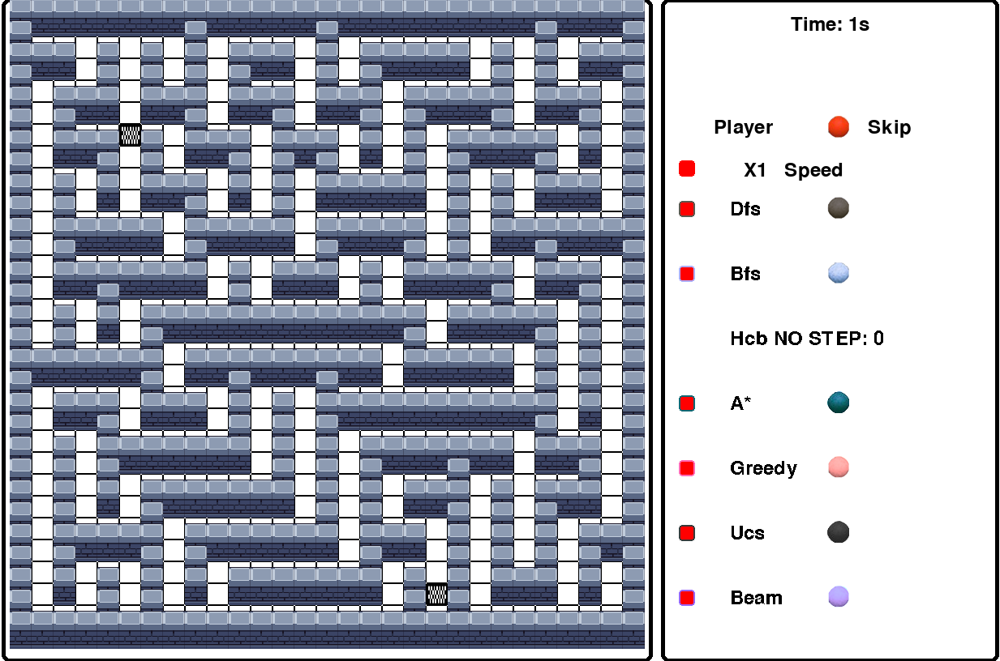
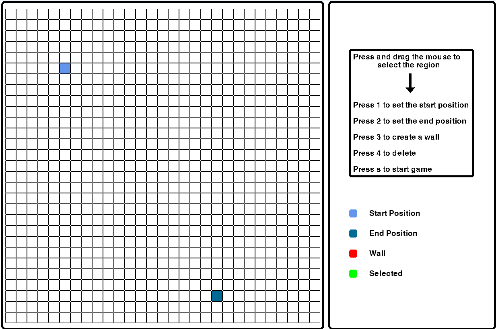
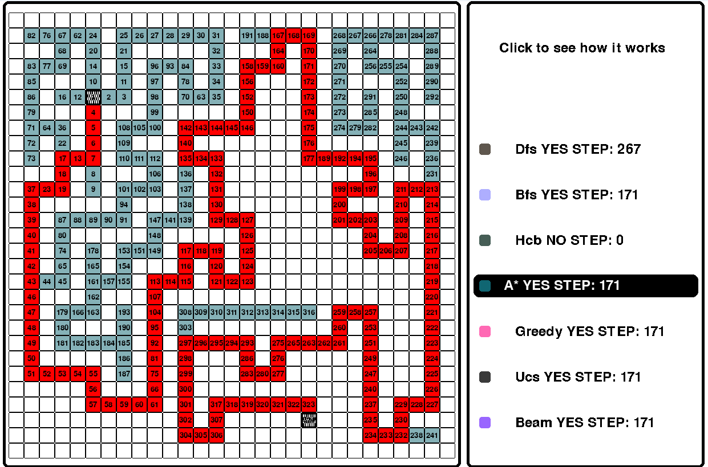

# 🧩 Maze Game with Pathfinding Algorithms

## 📌 Introduction
This project was developed as part of the **Artificial Intelligence** course at HCMUTE.  
Its goal is to simulate various **pathfinding algorithms** in a maze environment, allowing learners to visually compare how each algorithm works and performs.

Implemented algorithms:
- DFS (Depth-First Search)  
- BFS (Breadth-First Search)  
- Hill Climbing  
- A* Search  
- Greedy Best-First Search  
- Uniform Cost Search (UCS)  
- Beam Search  

The graphical interface is built using **Pygame**, enabling users to create maps, add obstacles, and observe the behavior of different algorithms in real time.

---

## 🎯 Objectives
- Visualize common pathfinding algorithms in a maze.  
- Allow users to create custom maps with start, goal, and walls.  
- Provide an interactive interface for studying and comparing algorithm efficiency.  

---

## 🛠️ Tools & Technologies
- **Python**  
- **Pygame** (interactive graphical interface)  
- **NumPy** (data manipulation)  
- **Queue / PriorityQueue** (for BFS, UCS, A*, DFS, GREEDY, HILLCLIMBING, BEAM)  
- **Random, Copy** (maze generation and state handling)  

---

## 🚀 How to Run
1. Install Python 3.9+  
2. Install required libraries:
   ```bash
   pip install -r requirements.txt
   ```
3. Run the application:
   ```bash
   python main.py
   ```

---

## 📖 Detailed Usage Guide



### Main Menu
When you launch the application, you'll see the main menu with three options:
- **Start**: Begin the game with a default maze
- **Create Map**: Design your own custom maze
- **Exit**: Close the application

### Creating a Custom Map
If you select **Create Map**, you can design your own maze:



1. **Select Region**: Press and drag your mouse to select a rectangular area for creating walls
2. **Set Start Position**: Press **1** to mark the starting position (where the player will begin)
3. **Set End Position**: Press **2** to mark the goal/end position (destination)
4. **Create Walls**: Press **3** to draw obstacles/walls in your selected region
5. **Delete Elements**: Press **4** to remove walls or other elements you've placed
6. **Start Game**: Press **S** to begin the game with your custom maze

### Game Controls

#### Navigation
- **Arrow Keys**: Move the player through the maze
- **Space**: Skip the player's turn

#### Algorithm Selection
During gameplay, you can activate multiple algorithms simultaneously by clicking on their checkboxes on the right panel. Each algorithm is represented by:
- **DFS** (Depth-First Search) - Red path
- **BFS** (Breadth-First Search) - Light blue path
- **Hill Climbing** - Dark cyan path
- **A* Search** - Teal path (heuristic-based)
- **Greedy Best-First Search** - Pink path
- **Uniform Cost Search (UCS)** - Dark gray path
- **Beam Search** - Purple path

#### Speed Control
- Adjust the speed slider at the bottom right to control how fast the algorithms and player move through the maze
- Drag the slider left (slower) or right (faster)

#### Activate All
- Click the **"Activate All"** checkbox to run all algorithms simultaneously and compare their performance

### After Algorithms Complete: Analyzing Results

After the algorithms finish running and reach the goal, you can analyze the results:



#### Viewing Final Paths
1. **Each algorithm's path is displayed in its unique color:**
   - Move the speed slider to the **rightmost** (fastest) position to let all algorithms finish
   - Once complete, all paths remain visible on the maze
   - The final path appears as a brighter/bolder line in each algorithm's color

2. **Comparing paths visually:**
   - Look at which algorithms took the most direct route
   - Observe which paths are longer or shorter
   - Note which algorithms overlapped their exploration (similar exploration patterns)

#### Reading Statistics on Right Panel
After completion, each algorithm shows:
- **Total Nodes Explored**: Number of cells examined (including backtracking)
- **Final Path Length**: Number of steps from start to goal
- **Algorithm Status**: Marked as complete if goal was found

#### Analyzing the Results

**Step 1: Compare Path Lengths**
- Look at the path length numbers on the right panel
- Shortest path = best solution
- Note which algorithms found the same (optimal) path

**Step 2: Evaluate Efficiency**
- Compare "Nodes Explored" vs "Path Length"
- A good algorithm finds short path with few explorations
- Calculate efficiency ratio: `Nodes Explored ÷ Path Length`
- Lower ratio = more efficient algorithm

**Step 3: Visual Pattern Analysis**
- **Wide exploration areas** = algorithm explored many cells
- **Narrow corridor of exploration** = algorithm went direct (uses heuristic well)
- **Multiple branching patterns** = algorithm tried different directions
- **Linear path to goal** = very efficient heuristic guidance

#### Detailed Review Steps

**To closely examine one algorithm's work:**
1. Reset/reload the maze
2. Disable all other algorithms
3. Enable only the target algorithm
4. Set speed to slowest (leftmost)
5. Watch it step-by-step and understand its decision-making

**To compare two algorithms directly:**
1. Run Algorithm A, note its path (screenshot helpful)
2. Reset/reload the same maze
3. Run Algorithm B, note its path
4. Compare the two paths side-by-side
5. Count steps and explorations for each

### Understanding the Visual Display

**Color Codes:**
- **Blue square**: Player position
- **Red square**: Goal/End position
- **Gray squares**: Walls
- **Colored paths**: Each algorithm's explored path (different color per algorithm)
- **Visited nodes**: Lighter shading indicates cells explored by each algorithm

**Right Panel Information:**
- Shows each algorithm with its own checkbox
- Displays the number of steps/nodes explored by each algorithm
- Visual representation of the path taken by each algorithm
- Status indicator showing if the algorithm found the goal
- **After completion**: Shows final statistics for result analysis

### Game Objective
Navigate your player from the start position to the goal position while observing how different pathfinding algorithms solve the same problem. Compare:
- **Efficiency**: Which algorithm uses the fewest steps?
- **Path Quality**: Does the algorithm find the optimal path?
- **Speed**: How fast does each algorithm explore the maze?

### Tips for Best Results
1. **Compare Algorithms**: Run multiple algorithms at once to see different approaches
2. **Custom Mazes**: Create interesting mazes with multiple possible paths to see how algorithms differ
3. **Adjust Speed**: Use the speed slider to follow the algorithm's decision-making process
4. **Study Behavior**: Observe how each algorithm explores differently:
   - DFS goes deep into one path
   - BFS explores evenly in all directions
   - A* and Greedy use heuristics to aim toward the goal
   - UCS considers path costs
   - Beam Search uses a limited frontier

### Step-by-Step Example: First Time Playing

**Scenario 1: Using the Default Maze**
1. Launch the application: `python main.py`
2. Click **"Start"** button on the main menu
3. Observe the default maze with start (blue), goal (red), and walls (gray)
4. Click checkboxes on the right panel to activate algorithms (start with 1-2 at a time)
5. Use the **speed slider** to slow down and watch how each algorithm explores
6. Compare the paths taken by different algorithms using the color legend
7. Note which algorithm finds the goal fastest and with the fewest steps

**Scenario 2: Creating Your Own Simple Maze**
1. From main menu, click **"Create Map"**
2. Drag mouse to select a region and press **3** to create walls (build an L-shaped or S-shaped maze)
3. Press **1** to set start position (top-left area)
4. Press **2** to set end position (bottom-right area)
5. Press **S** to start
6. Run algorithms and observe how they navigate your custom layout
7. Add more complexity: create multiple paths and see which algorithm finds the shortest one

**Scenario 3: Advanced Comparison Study**
1. Create a maze with multiple possible paths of different lengths
2. Activate all algorithms by clicking **"Activate All"** 
3. Slow down the speed to observe the exploration pattern
4. Note:
   - How many cells each algorithm explored (shown on right panel)
   - Which algorithms find the optimal (shortest) path
   - How the heuristic in A* and Greedy helps them explore fewer cells
5. Try the same maze with different start/end positions to see consistency
6. **After completion: Review Results**
   - Compare the final statistics (nodes explored, path length)
   - Create a table comparing all algorithms
   - Identify which was most efficient
   - Note any algorithms that failed or took longer paths

**Scenario 4: Results Analysis Checklist**
1. After all algorithms complete, check the right panel
2. Create a quick comparison:
   ```
   Algorithm | Nodes | Path | Optimal?
   ----------|-------|------|----------
   BFS       | 80    | 25   | Yes
   A*        | 65    | 25   | Yes
   Greedy    | 75    | 27   | No
   DFS       | 120   | 30   | No
   ```
3. Answer: Which was most efficient? Most optimal? Fastest to complete?
4. Draw conclusions about the maze difficulty and algorithm characteristics

---

## 📊 Algorithm Comparison

| Algorithm | Type | Optimality | Completeness | Remarks |
|-----------|------|-----------|--------------|---------|
| DFS | Uninformed | ❌ No | ✅ Yes | Explores deeply, can get stuck in long paths |
| BFS | Uninformed | ✅ Yes | ✅ Yes | Finds shortest path, explores level by level |
| A* | Informed | ✅ Yes | ✅ Yes | Uses heuristic + cost, very efficient |
| Greedy | Informed | ❌ No | ✅ Yes | Fast but not always optimal |
| Hill Climbing | Local | ❌ No | ❌ No | Can get stuck in local maxima |
| UCS | Cost-based | ✅ Yes | ✅ Yes | Considers path costs uniformly |
| Beam Search | Limited | ❌ No | ❌ No | Practical compromise between memory and quality |

---

## 💡 Key Insights to Gain

1. **Uninformed Search (DFS, BFS)**
   - Work without knowledge of target location
   - BFS guarantees shortest path but uses more memory
   - DFS uses less memory but may find longer paths

2. **Informed Search (A*, Greedy)**
   - Use heuristic function to guide search
   - A* is optimal when heuristic is admissible
   - Greedy is faster but may miss optimal solution

3. **Cost-Based Search (UCS)**
   - Important when edges have different weights
   - In this maze (unweighted), similar to BFS
   - Would differ significantly with weighted edges

4. **Practical Considerations**
   - Real-world often prefers A* or Greedy for speed
   - BFS when guarantee of optimality is critical
   - Memory constraints might force Beam Search or DFS

5. **Heuristic Quality**
   - Good heuristic = fewer nodes explored = faster
   - Manhattan distance is good for grid-based mazes
   - Watch how A* exploits the heuristic vs greedy

---

## 📄 License & Credits
Developed as part of the **Artificial Intelligence** course at HCMUTE.
[📋 View License](LICENSE)
For questions or improvements, feel free to contribute!

